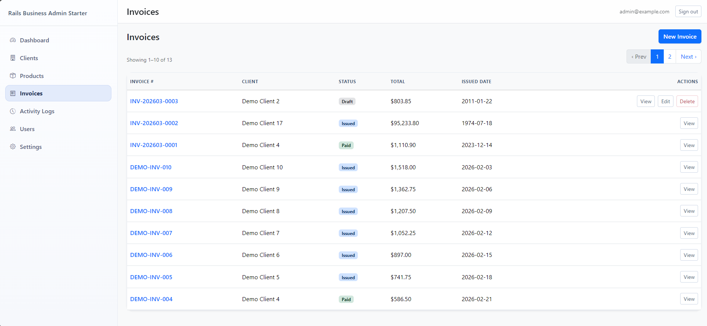
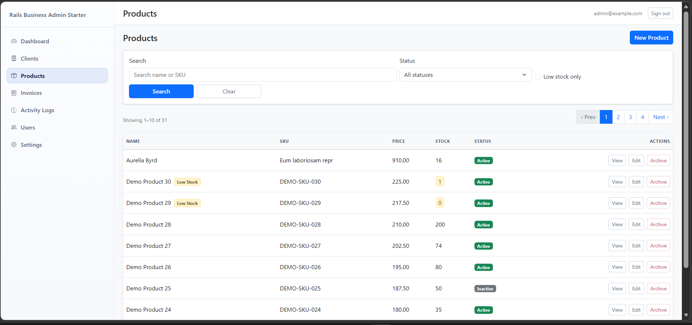

# 🚀 NovaAdmin – Rails 7 Admin Dashboard Starter

Production-ready Rails 7 admin dashboard starter for building internal tools fast.

---

## 🖥 Preview

---

## ✨ Tech Stack

- Ruby on Rails 7  
- Bootstrap 5  
- PostgreSQL  

---

## 📦 Features

- Clients Management  
- Products Management  
- Invoices System  
- Inventory Tracking  
- User Roles & Permissions  
- Activity Logs  
- System Settings  

---

## ⚡ Why NovaAdmin?

👉 Start faster  
👉 Skip boilerplate  
👉 Focus on business logic  

---

## 💰 Get Full Version

👉 Full source code + production-ready system:

🔗 https://abdelazizsoliman.gumroad.com/l/novaadmin

---

## ⚠️ Note

This repository is a teaser/demo only.

---

## 👨‍💻 Author

Abdelaziz Soliman