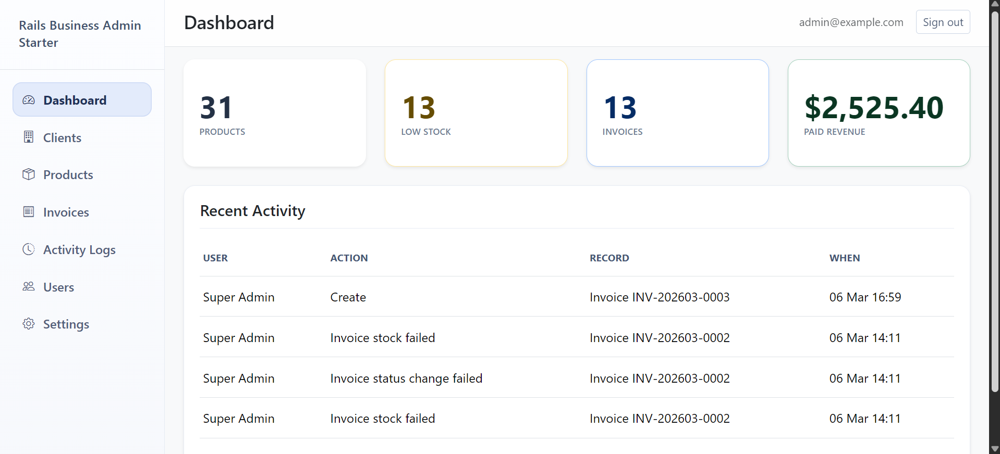

# 🚀 Rails Admin Business Starter – Rails 7 Admin Dashboard

Stop rebuilding admin panels from scratch.

Rails Admin Business Starter is a **production-ready Rails 7 system** that helps you launch internal tools, admin dashboards, and SaaS back offices in minutes.

---

## 🔥 Live Demo

👉 https://rails-business-admin-starter.onrender.com

---

## 💰 Get Full Version

👉 https://abdelaziz.lemonsqueezy.com/checkout/buy/9bdb91ad-35d3-4b21-98c1-aee6b37dc75f

---

## ⚡ What You Get

✔ Complete Rails 7 codebase  
✔ Authentication + Role-based access (Pundit)  
✔ Invoicing system (Draft → Issued → Paid)  
✔ Product & Inventory management  
✔ Client management  
✔ Dashboard metrics  
✔ Activity logs (audit system)  
✔ Clean, extensible architecture  

---

## ✨ Tech Stack

* Ruby on Rails 7
* PostgreSQL
* Bootstrap 5

---

## 🧾 Key Features

* Inventory auto deduction on invoice payment  
* PDF invoice export  
* Full audit logging for all actions  
* Archive / Restore logic  
* Production-ready structure for scaling  

---

## 🖼️ Screenshots

### Dashboard

### Invoices

### Products

---

## 🎯 Who is this for?

* Rails developers building admin systems  
* Freelancers delivering client dashboards  
* Agencies building internal tools  
* SaaS founders building MVPs  

---

## 🚀 Why This Starter?

Most developers waste days rebuilding:

❌ Auth  
❌ Roles  
❌ CRUD  
❌ Invoices  
❌ Admin UI  

👉 This starter gives you everything ready so you can focus on your actual product.

---

## 🧪 Demo Credentials

admin@example.com  
password123  

---

## ⚠️ Note

This repository is a **demo version only**.

👉 Full version (with complete features & source code):  
https://abdelaziz.lemonsqueezy.com/checkout/buy/9bdb91ad-35d3-4b21-98c1-aee6b37dc75f

---

## 👨‍💻 Author

Abdelaziz Soliman  
Rails Developer focused on building production-ready business systems
